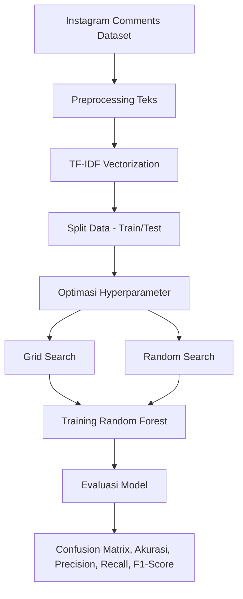

# 📊 Hyperparameter Optimization of Random Forests for Instagram Sentiment Analysis (Indonesian)

## Sentiment-Analyst

This project aims to analyze the sentiment of Indonesian-language Instagram comments using the Random Forest algorithm, which is effective at handling complex and non-linear data. The dataset contains comments that have been labeled as positive or negative sentiment. Preprocessing is performed to clean up informal text, remove stopwords, and transform the data into features that the model can understand. Hyperparameter optimization using RandomizedSearchCV (Random Search) successfully improved accuracy to 90%, proving the effectiveness of this method in addressing the challenges of informal text sentiment analysis.

---

## 🎯 What is this?

- **Focus:** Comparing hyperparameter optimization **Grid Search** vs **Random Search** in Random Forest.
- **Problem:** Handling informal text (abbreviations, slang, emojis), e.g., _“gemoy bgt sih 😍”_ or _“pdhl gk worth it”_.
- **Dataset:** 400 labeled comments (200 positive, 200 negative).

---

## 🔄 Pipeline Proses



---

## 🛠 **Tools Used**
| Component             | Technology/Library       |
|----------------------|-------------------------|
| Programming Language   | Python 3.8+             |
| Machine Learning     | Scikit-learn, Pandas    |
| NLP                 | TF-IDF, Sastrawi, NLTK  |
| Visualization         | Matplotlib, WordCloud   |

---

## ⚙️ Metode
1. **Preprocessing**
   - Case folding
   - Tokenisasi
   - Stopword removal (Bahasa Indonesia)
   - Stemming (Sastrawi)
   - TF-IDF Vectorization
2. **Model**
   - Random Forest
   - Hyperparameter tuning dengan:
     - Grid Search CV
     - Random Search CV
3. **Evaluasi**
   - Accuracy, Precision, Recall, F1-score
   - Confusion Matrix
   - Error rate
     
---
## 📈 **Main Results**
| Method               | Accuracy | Error Rate | Computation Time |
|----------------------|---------|------------|-----------------|
| Random Forest (Baseline) | 83%    | 16.67%     | 2 minutes         |
| + Grid Search        | 89.17%  | 10.83%     | 90 minutes        |
| **+ Random Search**  | **90%** | **10%**    | **25 minutes**    |

**Insight**:  
- Random Search is **more efficient** (3.6x faster than Grid Search) with the highest accuracy.
- Special preprocessing (e.g., normalization of “bgt” → “banget”) improves the F1-score by 8%.

---

Term Weighting Results from sentiment analysis using TF-IDF

  
*TF-IDF keyword visualization shows the frequency of words that influence sentiment.*

**Insight**
- The Word Cloud visualization shows the words that appear most frequently in Instagram comments. The size of the words is directly proportional to their frequency of occurrence, so larger words have a higher frequency of occurrence.
- Highlights certain emotionally charged words that are relevant for sentiment classification.

---

## 🔍 Confusion Matrix
**Confusion Matrix from RF Grid Search**.


The Grid Search model has higher True Positive and True Negative rates, resulting in fewer classification errors compared to Random Search.

**Confusion Matrix from RF Random Search**.


It provides fairly good classification results, but has slightly more False Positives and False Negatives compared to Grid Search.

**Notes**:
- X-axis: Model Prediction.
- Y-axis: True Label.
- TP (True Positive): Positive sentiment predicted as positive.
- TN (True Negative): Negative sentiment predicted as negative.
- FP (False Positive): Negative sentiment predicted as positive.
- FN (False Negative): Positive sentiment predicted as negative.

---

## 📊 Model Accuracy Comparison
  
*Random Search is faster and more accurate than Grid Search*

- The graph compares the accuracy of Random Forest models optimized using Grid Search and Random Search.
- The results show that Grid Search provides slightly higher accuracy than Random Search, although the difference is not very significant.
- Accuracy Comparison: relates performance differences to the number of hyperparameter combinations tested by each method.

---

## 📈 Statistical Test (Paired t-test)
1. RF Normal vs Grid Search
   
| No | Metrics | t-statistic | p-value | Significant (p<0.05) |
|----|---------|------------|-----------------|---------------|
|  1  | Accuracy | 9.750     | 0.006         |   ✅ Yes   |
|  2  | Recall | 2.236    | 0.089        |   ❌ No   |   
|  3  | Precision | 21.50    | 0.000    |   ✅ Yes   |
|  4  | F1-Score   | 1.359  | 0.235  |   ❌ No   |

Conclusion:
- Grid Search significantly improves Accuracy and Precision.
- There is no significant difference in Recall and F1-score.
- Suitable for applications that minimize False Positives (e.g., spam detection, disease diagnosis).

2. RF Normal vs Random Search

| No | Metrics | t-statistic | p-value | Significant (p<0.05) |
|----|---------|------------|-----------------|---------------|
|  1  | Accuracy | 4.221     | 0.013         |   ❌ No   |
|  2  | Recall | 0.620   | 0.569    |   ❌ No   |   
|  3  | Precision | -0.965    | 0.389    |   ❌ No   |
|  4  | F1-Score   | 7.171  | 0.002  |   ✅ Yes   |

Conclusion:
- Random Search significantly improves the F1-score → better balance between Precision and Recall.
- Suitable for datasets with class imbalance and the need to minimize FP & FN simultaneously.

---

## ⚙️ Environment Preparation
1. Clone repository:

   ```bash
   git clone https://github.com/Ahmadd1998/sentiment-analyst-.git
   cd sentiment-analyst-
   pip install -r requirements.txt
   
2. Open Notebook
   
   jupyter notebook notebooks/sentiment_analysis.ipynb

3. Install dependencies:

   Make sure you have Python version 3.7 or newer. Then, install the required dependencies:
   
   ```bash
   pip install -r requirements.txt
   ```
   
   If the requirements.txt file is not available, you can create it by adding the following libraries:
   
   - pandas
   - scikit-learn
   - numpy
   - matplotlib
   - seaborn
   - joblib
 
---

## 🧠 Analysis Steps
1. Text Preprocessing
   
   The **Preprocessing.py** script is used to clean and normalize Instagram comment text, including:
   
   - Removing URLs, mentions, and hashtags.
   - Converting text to lowercase.
   - Removing stopwords.
   - Performing stemming on words.
     
   Run this script to prepare the data for further analysis.

2. TF-IDF Analysis
   
   The **TF-IDF.py** script is used to:
   
   - Calculate feature representations using the TF-IDF method.
   - Display a visualization of word frequency distribution.
   
   Run this script to understand the distribution of words in the dataset.

3. Random Forest Model Without Optimization
   
   The **RF_Normal.py** script is used to:
   
   - Build a Random Forest model with default parameters.
   - Evaluate the model using accuracy and classification report.
   
   Run this script to obtain the baseline model.

4. Hyperparameter Optimization with Grid Search
   
   The **Grid_Search.py** script is used to:
   
   - Perform parameter search using the Grid Search method.
   - Evaluate the model with optimized parameters.
   
   Run this script to improve model performance.

5. Hyperparameter Optimization with Random Search
    
   The **Random_Search.py** script is used to:
   
   - Perform parameter search using the Random Search method.
   - Evaluate the model with optimized parameters.
   
   Run this script to obtain the model with the best performance.

---

## 📊 Visualization and Evaluation
After running the script above, you can evaluate the model by:

- Displaying the confusion matrix to see the distribution of predictions.
- Displaying the classification report for evaluation metrics such as precision, recall, and F1-score.
- Displaying feature importance to find out which features are most influential.

For visualization, you can use libraries such as **matplotlib** and **seaborn**.

---

## 💾 Saving and Using the Model
After obtaining the best model, you can save it using joblib:

```bash
**import joblib**
**joblib.dump(best_model, ‘sentiment_model.pkl’)**
```

To load and use the model:

```bash
**import joblib**
**model = joblib.load(‘sentiment_model.pkl’)**
**predictions = model.predict(new_data)**
```

By following the steps above, you can run and explore this sentiment analysis project. Make sure to adjust the file paths and parameters according to your needs.

---

## Contributors
- [Ahmad Gozali A.](https://github.com/Ahmadd1998) — Researcher & Developer
- [Abu Salam] — Academic Supervisor & Idea Provider
  
---
This project is licensed under the MIT License. If you wish to contribute, please fork this repository and submit a pull request with your proposed changes.
