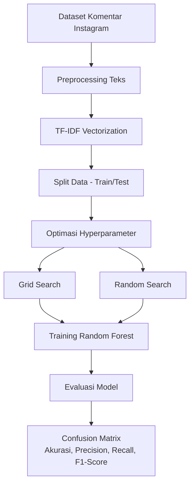
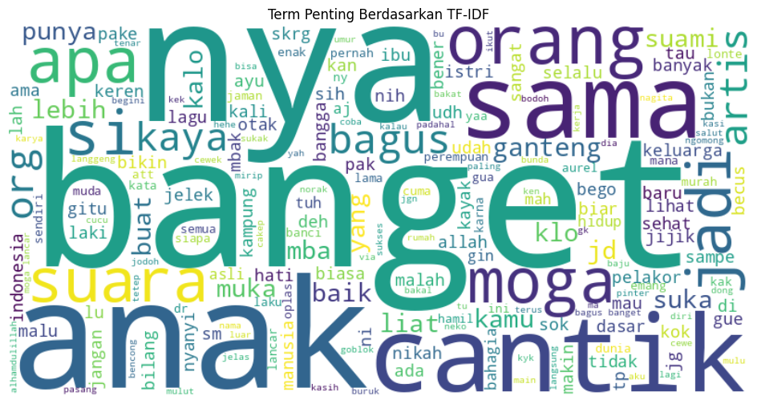
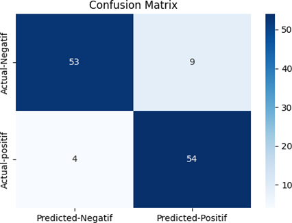
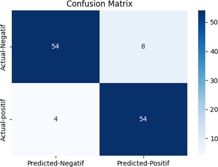
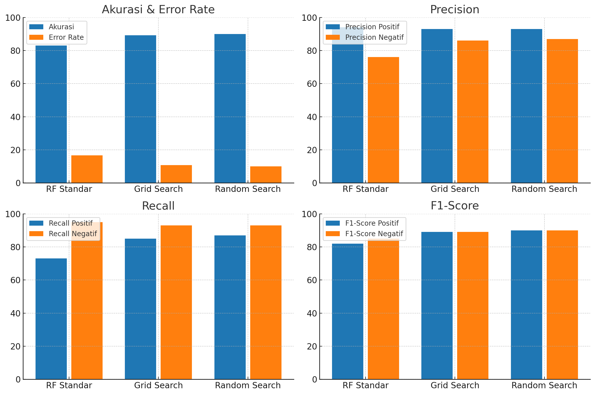

# 📊 Optimasi Hyperparameter Random Forest untuk Analisis Sentimen Instagram (Bahasa Indonesia)

# sentiment-analyst
Proyek analisis sentimen komentar Instagram Bahasa Indonesia dengan optimasi hyperparameter Random Forest. Mencapai akurasi 90% menggunakan Random Search dan preprocessing teks informal.

## 🎯 **Apa Ini?**
Proyek ini membangun **model klasifikasi sentimen** untuk komentar Instagram berbahasa Indonesia dengan:
- **Fokus Utama**: Membandingkan teknik optimasi hyperparameter (**Grid Search** vs **Random Search**) pada algoritma Random Forest.
- **Problem Unik**: Menangani karakteristik teks informal (singkatan, bahasa gaul, emoji) seperti _"gemoy bgt sih 😍"_ atau _"pdhl gk worth it"_.
- **Dataset**: 400 komentar berlabel (200 positif + 200 negatif).

### 🔄 Diagram Alur Proses (Pipeline)
Dengan alur proses yang digunakan sebagai berikut

---

## 🛠 **Teknologi yang Digunakan**
| Komponen             | Teknologi/Library       |
|----------------------|-------------------------|
| Bahasa Pemrograman   | Python 3.8+             |
| Machine Learning     | Scikit-learn, Pandas    |
| NLP                 | TF-IDF, Sastrawi, NLTK  |
| Visualisasi         | Matplotlib, WordCloud   |

---

## ⚙️ Metode
1. **Preprocessing**
   - Case folding
   - Tokenisasi
   - Stopword removal (Bahasa Indonesia)
   - Stemming (Sastrawi)
   - TF-IDF Vectorization
2. **Model**
   - Random Forest
   - Hyperparameter tuning dengan:
     - Grid Search CV
     - Random Search CV
3. **Evaluasi**
   - Accuracy, Precision, Recall, F1-score
   - Confusion Matrix
   - Error rate
     
---

## 📈 **Hasil Utama**
| Metode               | Akurasi | Error Rate | Waktu Komputasi |
|----------------------|---------|------------|-----------------|
| Random Forest (Baseline) | 83%    | 16.67%     | 2 menit         |
| + Grid Search        | 89.17%  | 10.83%     | 90 menit        |
| **+ Random Search**  | **90%** | **10%**    | **25 menit**    |

**Insight**:  
- Random Search **lebih efisien** (3.6x lebih cepat dari Grid Search) dengan akurasi tertinggi.
- Preprocessing khusus (contoh: normalisasi "bgt" → "banget") meningkatkan F1-score sebesar 8%.

---

Hasil Term Weighting dari analis sentimen menggunakan TF-IDF

  
*Visualisasi kata kunci menggunakan TF-IDF*

**Insight**
- Visualisasi Word Cloud menunjukkan kata-kata yang paling sering muncul pada komentar Instagram. Ukuran kata berbanding lurus dengan frekuensi kemunculannya, sehingga kata yang lebih besar memiliki tingkat kemunculan lebih tinggi.
- menonjolkan kata-kata bermuatan emosi tertentu yang relevan untuk klasifikasi sentimen.

---

## 🔍 Confusion Matrix
**Confusion Matrix dari RF Grid Search**.

Model hasil Grid Search memiliki True Positive dan True Negative yang lebih tinggi, sehingga kesalahan klasifikasi lebih sedikit dibanding Random Search.

**Confusion Matrix dari RF Random Search**.

Memberikan hasil klasifikasi yang cukup baik, namun memiliki False Positive dan False Negative sedikit lebih banyak dibandingkan Grid Search.

**Keterangan**:
- Sumbu X: Prediksi Model.
- Sumbu Y: Label Asli.
- TP (True Positive): Sentimen positif terprediksi positif.
- TN (True Negative): Sentimen negatif terprediksi negatif.
- FP (False Positive): Sentimen negatif terprediksi positif.
- FN (False Negative): Sentimen positif terprediksi negatif.

---

## 📊 Perbandingan Akurasi Model
  
*Random Search lebih cepat dan akurat dibanding Grid Search*

- Grafik membandingkan akurasi model Random Forest yang dioptimasi menggunakan Grid Search dan Random Search.
- Hasil menunjukkan bahwa Grid Search memberikan akurasi sedikit lebih tinggi dibanding Random Search, meskipun perbedaannya tidak terlalu signifikan.
- Perbandingan Akurasi: mengaitkan perbedaan performa dengan jumlah kombinasi hyperparameter yang diuji oleh masing-masing metode.

🚀 Cara Menjalankan
1. Clone Repository
   
   git clone https://github.com/username/sentiment-analyst.git
   
   cd sentiment-analyst
   
3. Buat Virtual Environment (Opsional, tapi disarankan)
   
   python -m venv venv
   
   source venv/bin/activate --- # Untuk Linux/Mac
   
   venv\Scripts\activate    --- # Untuk Windows
   
4. Install Dependencies
   
   pip install -r requirements.txt
   
5. Siapkan Dataset
   - Letakkan file dataset CSV di folder dataset/ (jika belum ada, buat foldernya)
   - Pastikan nama file sesuai yang digunakan di script Python, contoh:
   
   dataset/dataset_instagram_cyberbullying.csv
   
6. Jalankan Script Analisis Sentimen
   
   python main.py
   
7. Lihat Hasil
   - Word Cloud akan tersimpan di folder output/wordcloud.png
   - Confusion Matrix & Grafik Perbandingan Akurasi akan tersimpan di folder output/
   - Console akan menampilkan Akurasi, Precision, Recall, dan F1-Score.
