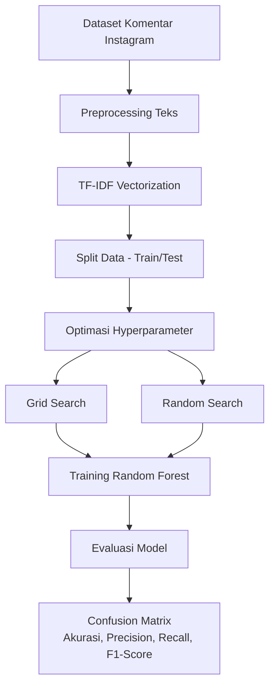

# 📊 Optimasi Hyperparameter Random Forest untuk Analisis Sentimen Instagram (Bahasa Indonesia)

# Sentiment-Analyst
Proyek analisis sentimen komentar Instagram Bahasa Indonesia dengan optimasi hyperparameter Random Forest. Mencapai akurasi 90% menggunakan Random Search dan preprocessing teks informal.

## 🎯 **Apa Ini?**
Proyek ini membangun **model klasifikasi sentimen** untuk komentar Instagram berbahasa Indonesia dengan:
- **Fokus Utama**: Membandingkan teknik optimasi hyperparameter (**Grid Search** vs **Random Search**) pada algoritma Random Forest.
- **Problem Unik**: Menangani karakteristik teks informal (singkatan, bahasa gaul, emoji) seperti _"gemoy bgt sih 😍"_ atau _"pdhl gk worth it"_.
- **Dataset**: 400 komentar berlabel (200 positif + 200 negatif).

### 🔄 Diagram Alur Proses (Pipeline)
Dengan alur proses yang digunakan sebagai berikut

---

## 🛠 **Teknologi yang Digunakan**
| Komponen             | Teknologi/Library       |
|----------------------|-------------------------|
| Bahasa Pemrograman   | Python 3.8+             |
| Machine Learning     | Scikit-learn, Pandas    |
| NLP                 | TF-IDF, Sastrawi, NLTK  |
| Visualisasi         | Matplotlib, WordCloud   |

---

## ⚙️ Metode
1. **Preprocessing**
   - Case folding
   - Tokenisasi
   - Stopword removal (Bahasa Indonesia)
   - Stemming (Sastrawi)
   - TF-IDF Vectorization
2. **Model**
   - Random Forest
   - Hyperparameter tuning dengan:
     - Grid Search CV
     - Random Search CV
3. **Evaluasi**
   - Accuracy, Precision, Recall, F1-score
   - Confusion Matrix
   - Error rate
     
---

## 📈 **Hasil Utama**
| Metode               | Akurasi | Error Rate | Waktu Komputasi |
|----------------------|---------|------------|-----------------|
| Random Forest (Baseline) | 83%    | 16.67%     | 2 menit         |
| + Grid Search        | 89.17%  | 10.83%     | 90 menit        |
| **+ Random Search**  | **90%** | **10%**    | **25 menit**    |

**Insight**:  
- Random Search **lebih efisien** (3.6x lebih cepat dari Grid Search) dengan akurasi tertinggi.
- Preprocessing khusus (contoh: normalisasi "bgt" → "banget") meningkatkan F1-score sebesar 8%.

---

Hasil Term Weighting dari analis sentimen menggunakan TF-IDF

  
*Visualisasi kata kunci menggunakan TF-IDF*

**Insight**
- Visualisasi Word Cloud menunjukkan kata-kata yang paling sering muncul pada komentar Instagram. Ukuran kata berbanding lurus dengan frekuensi kemunculannya, sehingga kata yang lebih besar memiliki tingkat kemunculan lebih tinggi.
- menonjolkan kata-kata bermuatan emosi tertentu yang relevan untuk klasifikasi sentimen.

---

## 🔍 Confusion Matrix
**Confusion Matrix dari RF Grid Search**.

Model hasil Grid Search memiliki True Positive dan True Negative yang lebih tinggi, sehingga kesalahan klasifikasi lebih sedikit dibanding Random Search.

**Confusion Matrix dari RF Random Search**.

Memberikan hasil klasifikasi yang cukup baik, namun memiliki False Positive dan False Negative sedikit lebih banyak dibandingkan Grid Search.

**Keterangan**:
- Sumbu X: Prediksi Model.
- Sumbu Y: Label Asli.
- TP (True Positive): Sentimen positif terprediksi positif.
- TN (True Negative): Sentimen negatif terprediksi negatif.
- FP (False Positive): Sentimen negatif terprediksi positif.
- FN (False Negative): Sentimen positif terprediksi negatif.

---

## 📊 Perbandingan Akurasi Model
  
*Random Search lebih cepat dan akurat dibanding Grid Search*

- Grafik membandingkan akurasi model Random Forest yang dioptimasi menggunakan Grid Search dan Random Search.
- Hasil menunjukkan bahwa Grid Search memberikan akurasi sedikit lebih tinggi dibanding Random Search, meskipun perbedaannya tidak terlalu signifikan.
- Perbandingan Akurasi: mengaitkan perbedaan performa dengan jumlah kombinasi hyperparameter yang diuji oleh masing-masing metode.

---

## 📈 Uji Statistik (Paired t-test) 
1. RF Normal vs Grid Search
   
| No | Metrics | t-statistic | p-value | Significant (p<0.05) |
|----|---------|------------|-----------------|---------------|
|  1  | Accuracy | 9.750     | 0.006         |   ✅ Yes   |
|  2  | Recall | 2.236    | 0.089        |   ❌ No   |   
|  3  | Precision | 21.50    | 0.000    |   ✅ Yes   |
|  4  | F1-Score   | 1.359  | 0.235  |   ❌ No   |

Kesimpulan:
- Grid Search meningkatkan Accuracy dan Precision secara signifikan.
- Tidak ada perbedaan signifikan pada Recall dan F1-score.
- Cocok untuk aplikasi yang meminimalkan False Positives (contoh: deteksi spam, diagnosis penyakit).

2. RF Normal vs Random Search
   
| No | Metrics | t-statistic | p-value | Significant (p<0.05) |
|----|---------|------------|-----------------|---------------|
|  1  | Accuracy | 4.221     | 0.013         |   ❌ No   |
|  2  | Recall | 0.620   | 0.569    |   ❌ No   |   
|  3  | Precision | -0.965    | 0.389    |   ❌ No   |
|  4  | F1-Score   | 7.171  | 0.002  |   ✅ Yes   |

Kesimpulan:
- Random Search meningkatkan F1-score secara signifikan → keseimbangan Precision dan Recall lebih baik.
- Cocok untuk dataset dengan class imbalance dan kebutuhan meminimalkan FP & FN sekaligus.

---

## ⚙️ Persiapan Lingkungan
1. Clone repository:

git clone https://github.com/Ahmadd1998/sentiment-analyst-.git
cd sentiment-analyst-

2. Install dependensi:

Pastikan Anda memiliki Python versi 3.7 atau lebih baru. Kemudian, install dependensi yang diperlukan:

pip install -r requirements.txt

Jika file requirements.txt belum tersedia, Anda dapat membuatnya dengan menambahkan pustaka berikut:

pandas
scikit-learn
numpy
matplotlib
seaborn
joblib

---

## 🧠 Langkah-langkah Analisis
1. Preprocessing Teks
Skrip **Preprocessing.py** digunakan untuk melakukan pembersihan dan normalisasi teks komentar Instagram, termasuk:

- Menghapus URL, mention, dan hashtag.
- Mengubah teks menjadi huruf kecil.
- Menghapus kata-kata tidak penting (stopwords).
- Melakukan stemming pada kata-kata.
  
Jalankan skrip ini untuk mempersiapkan data sebelum analisis lebih lanjut.

2. Analisis TF-IDF
Skrip **Analyze_TF-IDF.py** digunakan untuk:

- Menghitung representasi fitur menggunakan metode TF-IDF.
- Menampilkan visualisasi distribusi frekuensi kata.

Jalankan skrip ini untuk memahami distribusi kata dalam dataset.

3. Model Random Forest Tanpa Optimasi
Skrip  **RF_Normal.py** digunakan untuk:

- Membangun model Random Forest dengan parameter default.
- Melakukan evaluasi model menggunakan akurasi dan classification report.

Jalankan skrip ini untuk mendapatkan baseline model.

4. Optimasi Hyperparameter dengan Grid Search
Skrip **Grid_Search.py** digunakan untuk:

- Melakukan pencarian parameter terbaik menggunakan metode Grid Search.
- Melakukan evaluasi model dengan parameter yang dioptimasi.

Jalankan skrip ini untuk meningkatkan performa model.

5. Optimasi Hyperparameter dengan Random Search
Skrip **Random_Search.py** digunakan untuk:

- Melakukan pencarian parameter terbaik menggunakan metode Random Search.
- Melakukan evaluasi model dengan parameter yang dioptimasi.

Jalankan skrip ini untuk mendapatkan model dengan performa terbaik.

---

## 📊 Visualisasi dan Evaluasi
Setelah menjalankan skrip di atas, Anda dapat melakukan evaluasi model dengan:

- Menampilkan confusion matrix untuk melihat distribusi prediksi.
- Menampilkan classification report untuk metrik evaluasi seperti precision, recall, dan F1-score.
- Menampilkan feature importance untuk mengetahui fitur mana yang paling berpengaruh.

Untuk visualisasi, Anda dapat menggunakan pustaka seperti **matplotlib** dan **seaborn**.

---

## 💾 Menyimpan dan Menggunakan Model
Setelah mendapatkan model terbaik, Anda dapat menyimpannya menggunakan joblib:

import joblib
joblib.dump(best_model, 'sentiment_model.pkl')

Untuk memuat dan menggunakan model:

import joblib
model = joblib.load('sentiment_model.pkl')
predictions = model.predict(new_data)

Dengan mengikuti langkah-langkah di atas, Anda dapat menjalankan dan mengeksplorasi proyek analisis sentimen ini. Pastikan untuk menyesuaikan jalur file dan parameter sesuai dengan kebutuhan Anda.
